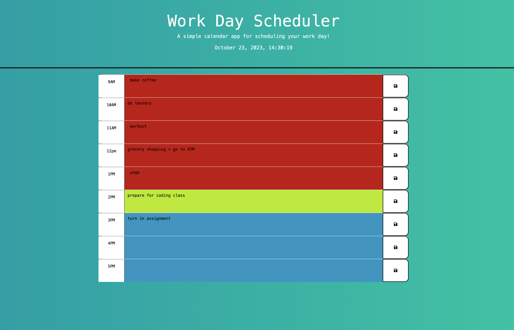

# Calendar Schedule App
A repo for the week 5 challenge that creates a calendar tool for scheduling tasks.

## User Story

```md
AS AN employee with a busy schedule
I WANT to add important events to a daily planner
SO THAT I can manage my time effectively
```

## Acceptance Criteria

```md
GIVEN I am using a daily planner to create a schedule
WHEN I open the planner
THEN the current day is displayed at the top of the calendar
WHEN I scroll down
THEN I am presented with timeblocks for standard business hours of 9am&ndash;5pm
WHEN I view the timeblocks for that day
THEN each timeblock is color coded to indicate whether it is in the past, present, or future
WHEN I click into a timeblock
THEN I can enter an event
WHEN I click the save button for that timeblock
THEN the text for that event is saved in local storage
WHEN I refresh the page
THEN the saved events persist
```

## Webpage Overview
- Header: Displays the app title, a brief description, and the current date.
- Main Content: Dynamically generated timeblocks for the hours of 9AM-5PM. Each timeblock consists of an hour label, a textarea for inputting tasks/events, and a save button.
- Colors: Timeblocks are color-coded based on the current time - past hours are marked in one color, the present hour in another, and future hours in yet another.

## App Structure and Features
- Dynamic Timeblocks: Timeblocks are created dynamically for standard business hours. They are appended to the main container using JavaScript.
- Local Storage: Tasks/events entered into the timeblocks are saved into the browser's local storage. They remain visible even after refreshing the page.
- Color Coding: Each timeblock is color-coded to indicate whether the time it represents is in the past, present, or future.
- Date Display: The current date is displayed at the top of the page, making it easy for users to see the day at a glance.
- External Libraries: The app uses Bootstrap for styling, Font Awesome for icons, Google Fonts for typography, jQuery for JavaScript simplification, and dayjs for date and time management.

## App Screenshot


## App Url Link
https://tyleryannes94.github.io/calendar-schedule/